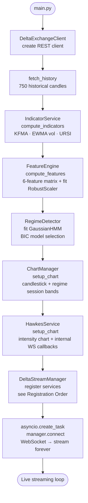
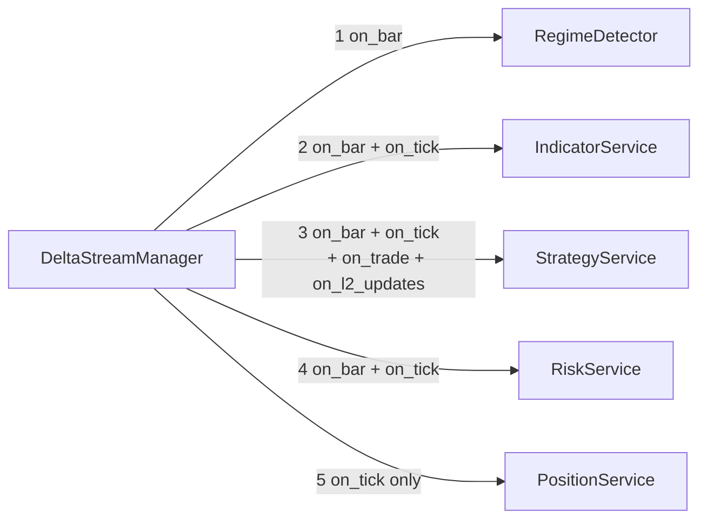
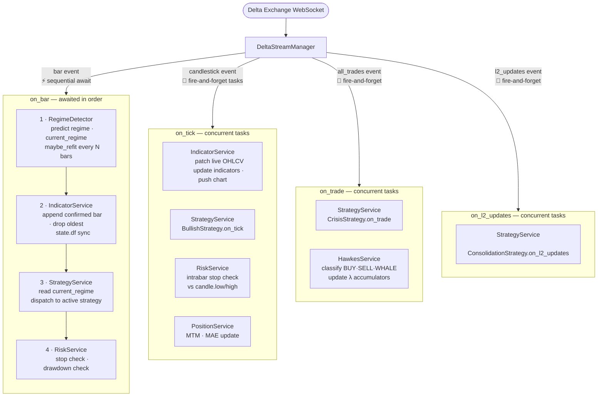
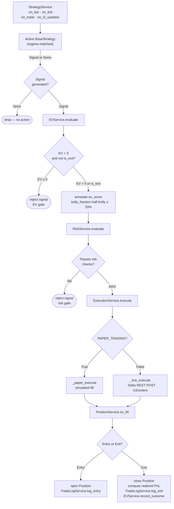
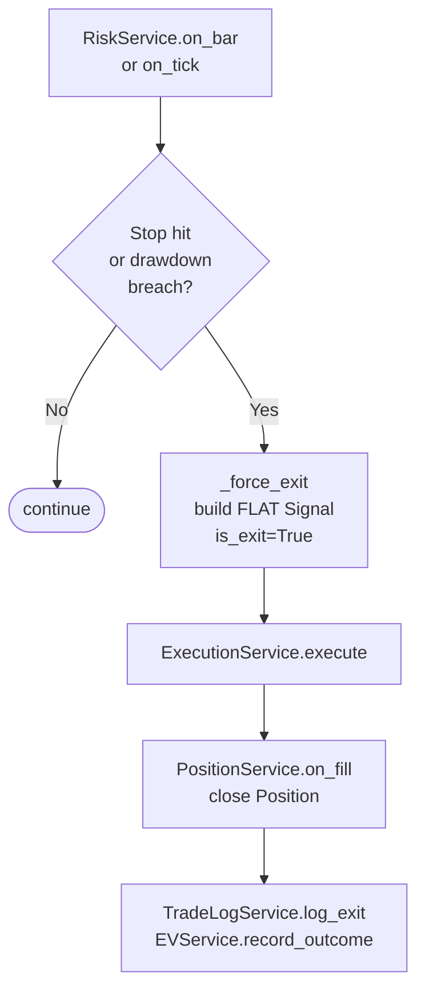
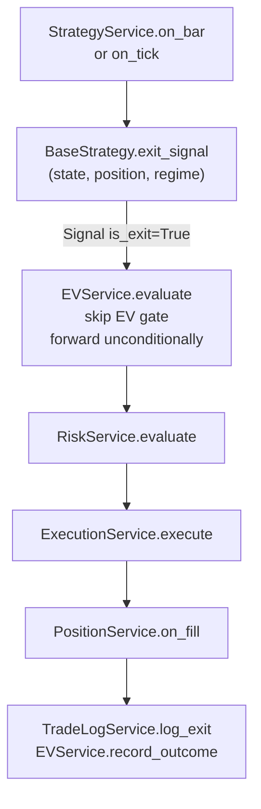
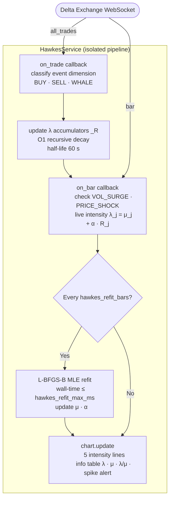
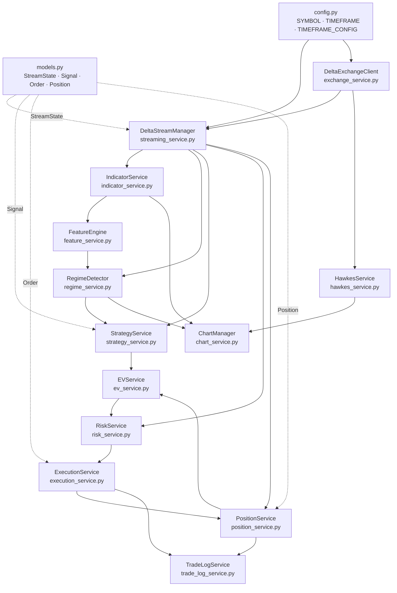

# QuantConsole — Orchestration & Lifecycle Graph

Visual reference for service orchestration, event dispatch, and the signal-to-fill pipeline.

---

## 1. Bootstrap Sequence

---

## 2. Service Registration Order

Services are registered sequentially; order governs the `on_bar` execution sequence.

---

## 3. Event Dispatch Model

---

## 4. Signal Pipeline — Entry

---

## 5. Signal Pipeline — Force Exit (Risk-Manager)

---

## 6. Strategy-Initiated Exit

---

## 7. HawkesService — Parallel Intensity Pipeline

HawkesService is **not yet a StreamService**. It owns its own internal WS callbacks.

---

## 8. Full Service Dependency Graph

